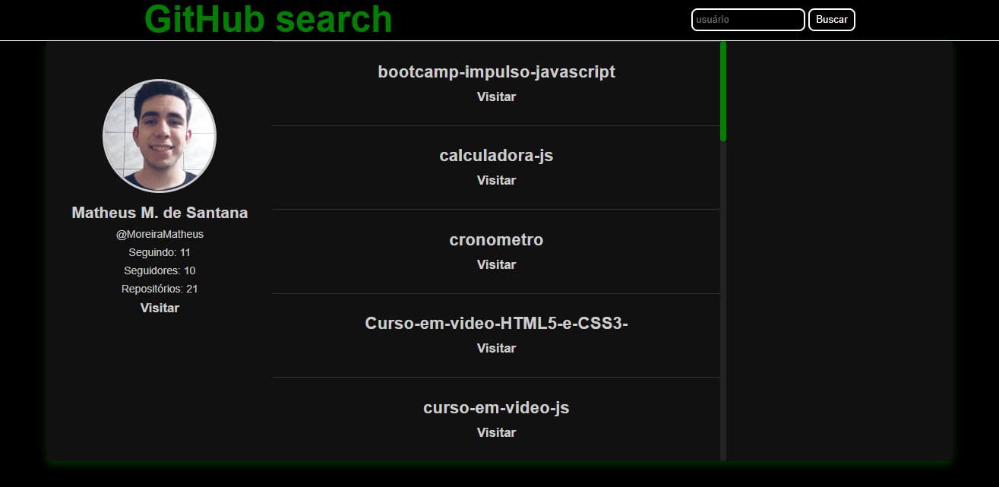

<div style="width: 600px; margin: auto; text-align: center">
    <h1>Github-Search</h1>
    
</div>

Projeto que busca perfis no Github através de fetch API, após a busca dos perfis é mostrado na tela os repositórios e alguns dados da conta do dev.

## Tecnologias 🔧

* JavaScript (linguagem de programação)
* React.js (biblioteca)
* Styled components (biblioteca)

## Testando o projeto na sua máquina 💻

Após clonar o repositório na sua máquina vá até o terminal e digite:

```node
npm install
```

O código acima irá instalar as dependências do projeto, com as dependências instaladas digite o comando:

```node
npm start
```

O projeto será iniciado e você será direcionado para o endereço: [http://localhost:3000](http://localhost:3000)

## Links importantes 🔗

[documentação 'create-react-app' no github](https://github.com/facebook/create-react-app)

[documentação React](https://reactjs.org/)

[api Github](https://docs.github.com/pt/rest)

[projeto que usei como base](https://github-profiles.netlify.app)